

# Project Ragnauwie

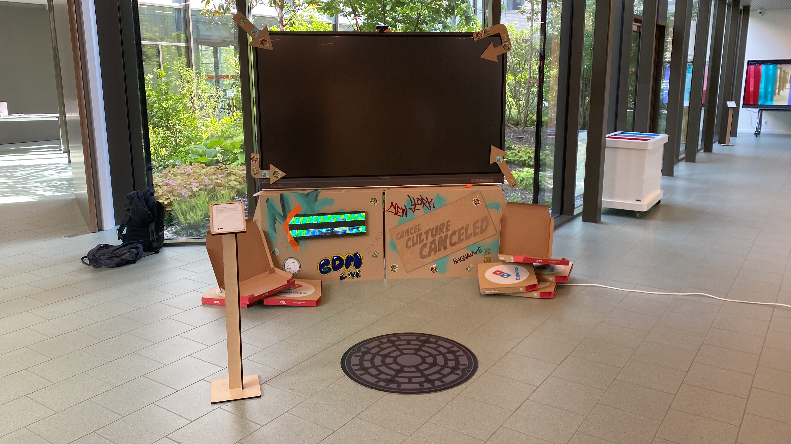

## Achtergrond

Het concept voor onze installatie is om te zien hoe humor is veranderd doorheen de tijd omdat sommige grapjes "woke" zijn hebben wij een installatie gemaakt waar je humor wordt getest aan de hand van memes videos en gif's die wij je tonen. De memes worden darker & darker hoe meer je naar rechts swiped.

De hardware die werd gebruikt waren meerdere libary's die we vonden op github het meeste werk van de programmeer taal was javascript.

## Benodigdheden

* Computer
* Visual Code
* Raspberry Pi
* RGB LED Matrix Panel - 64x64 x3
* The RGB LED Matrix Controller
* Ethernet Cable
* Webcam HD
* ViewBoard Interactive Touchscreen
* Karton
* Hout
* Stickers
* Verf Graffiti
* Plakband
* Pizza dozen x7

## Stap 1: Design

Als thema hebben we Teenage Mutant Ninja Turtles genomen. Dit speelt af in NewYorkCity. Om dit duidelijk te maken hebben we elk groepslid gelinkt met een ninja naar gelang onze karakter. 

* Michelangelo = Bilal
* Raffaello = Kenneth
* Donatello = Armin

De NewYork stijl zie je in de materialen. Graffiti en verf dat gebruikt is op het karton. Stickers die overal geplakt zijn. We hebben een grote riooldeksel dat een referentie is naar de thuisbasis van de Turtles. LED lights kom je vaak tegen in NewYork. Denk maar bijvoorbeeld aan Times Square. (Dit wordt dieper uitgelegd in stap 3) En niet te vergeten de pizza dozen die overal hangen. Dit is referentie naar Michelangelo (een enorme pizza-fan). De pizza dozen hebben we gehaald van Domino's. Deze hebben we gekregen door te vragen of ze er een paar konden geven.

De kartonnen muren die het scherm gedeeltelijk bedekken zijn gesneden met behulp van dit zelfgemaakte template. Hiervan zijn er twee uitgesneden en aan elkaar geplakt.

De afmetingen van het Illustrator bestand zijn de exacte afmetingen van het karton. De snijlijnen zet je in het rood onder een laag genaamd "Thru-cut". En de vouwlijnen zet je in het blauw onder een laag genaamd "buiging".

In één van de kartonnen is er een kleine gat manueel uitgesneden om de rasperryPi te verbinden met de RGB LED Matrix panelen. Zo konden we de rPi verstoppen zodat het niet zichtbaar is voor de gebruikers. De rPi is dan uiteindelijk geplakt met lijm en voor extra steun was er plakband gebruikt. (dit is oke omdat het in onze thema past) Op het andere karton was er een houten plaat geplakt (met lijm) met 'Cancel Culture Canceled' op geschreven. Dit was er op geschreven door gebruik te maken van een lasercutter.

De stickers zijn gemaakt met behulp van MidJourney. Vervolgens zijn ze gestoken in Illustrator om ze net zoals de karton de juiste laagnamen te geven. (De stickers zijn geprint geweest en uitgesneden met machines.) De snijlijnen zitten onder de laag genaamd "CutCounter".

## Stap 2: Code

We maken gebruik van 2 libary's:
* MediaPipe Hands
* Face-api

### Start pagina

De eerste pagina die te zien is op de installatie is heel simpel.
Op vlak van javascript doet het maar 2 dingen:
* Door een array van zinnen gaan om te laten zien op het scherm
 
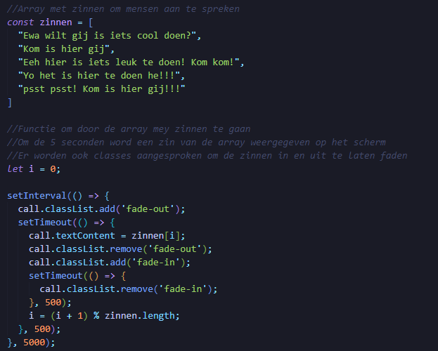

* Detecteren of de user swipet om door te gaan naar de volgende pagina

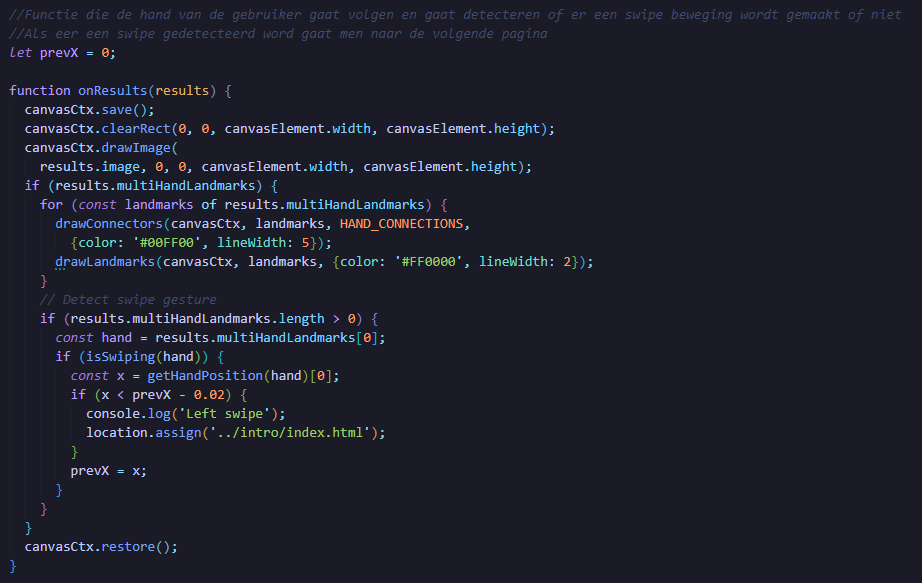

### Intro pagina

De intro pagina geeft de user eigenlijk uitleg over wat de installatie doet en hoe men hem moet gebruiken.
Door te swipen krijgt de user alle nodige uitleg te zien.

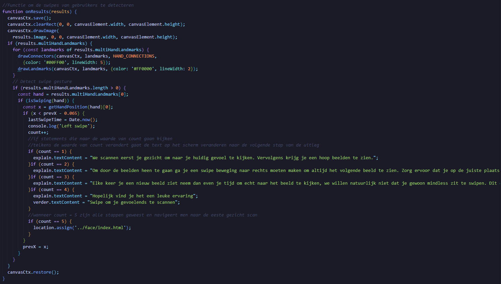

### Face pagina

Op de face pagina wordt de user zijn/haar gezicht gescant via de camera feed. Dit gebeurt met behulp fan de Face-api library.
De hoofd functies van de code doen 3 dingen:
* De user zijn/haar gezicht scannen en de hoofd uitdrukking opslaan.

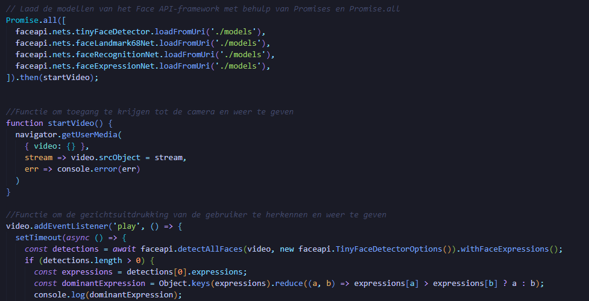

* Bij de gedecteerde uitdrukking de juiste foto en zin tonen.

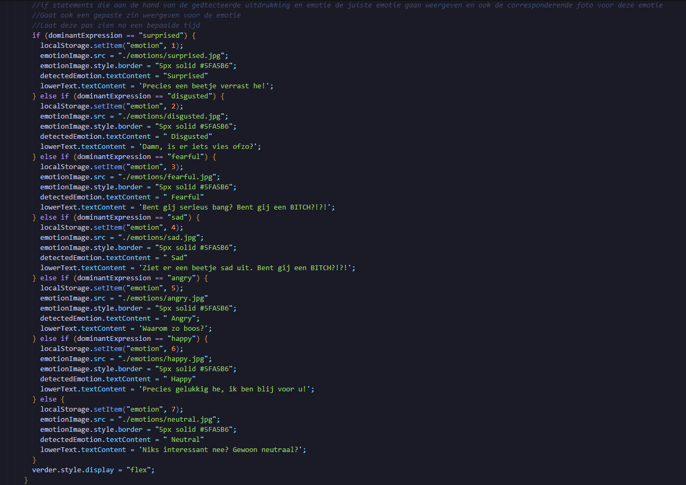

* Wanneer de user swipet doorgaan naar de main pagina.

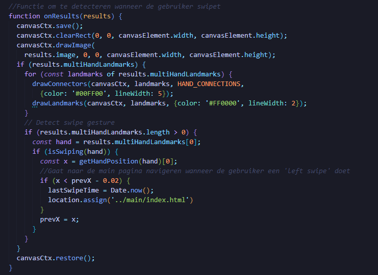

### Main pagina

De main pagina is waar de installatie eigenlijk om draait. Op deze pagina gaat de user verschillende memes van verschillende categorieën humor te zien krijgen.
Om door de beelden te gaan moet de user swipen, bij elke swipe beweging krijgt de user een volgende meme te zien. Op bepaalde momenten wordt de user ook naar een volgende pagina gestuurd om nog eens zijn/haar gezicht te scannen, deze code is hetzelfde als bij de face pagina.
Op vlak van javascript zijn er 2 hoofd functies:
* Telkens een andere random meme laten zien wanneer de user swipet.

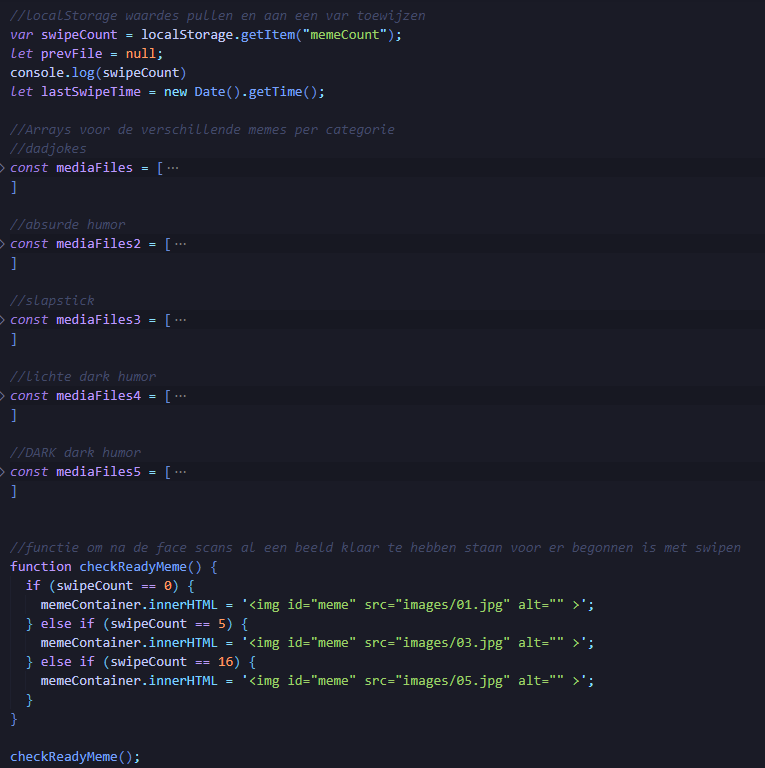
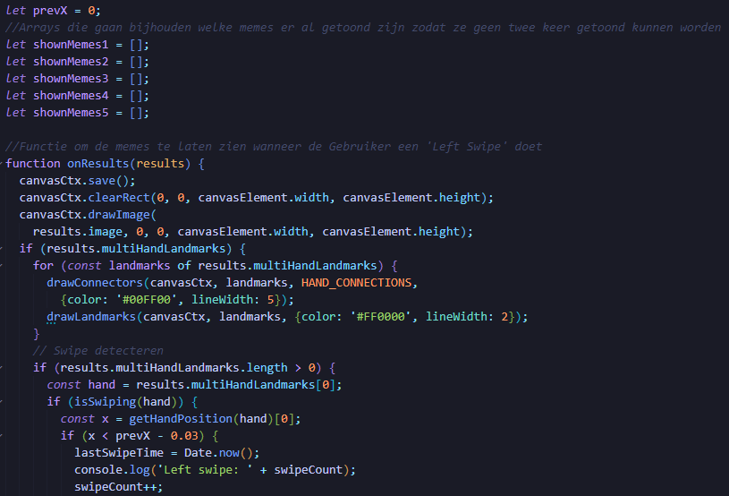
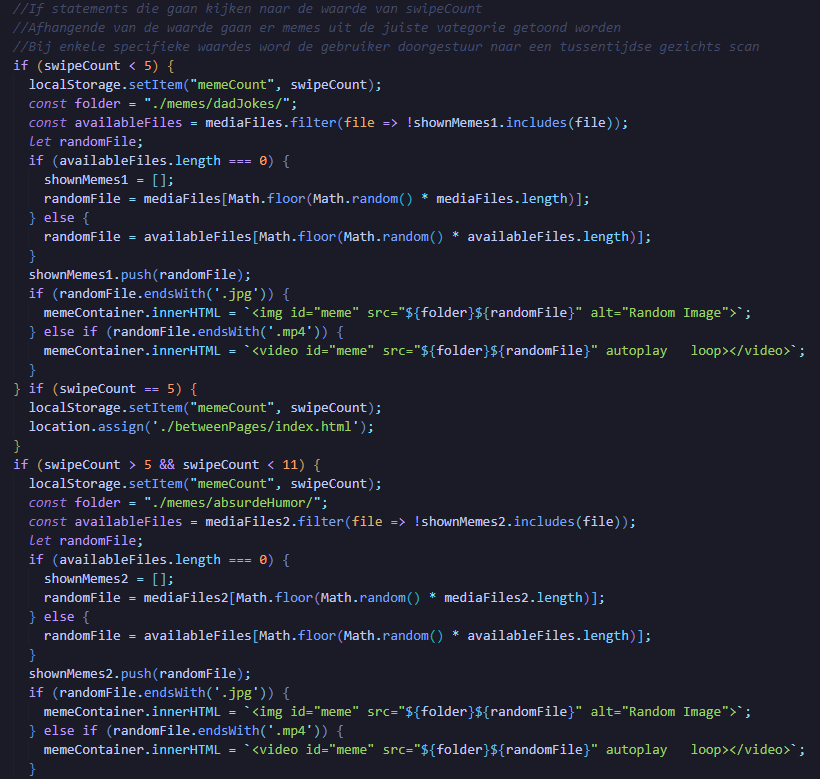
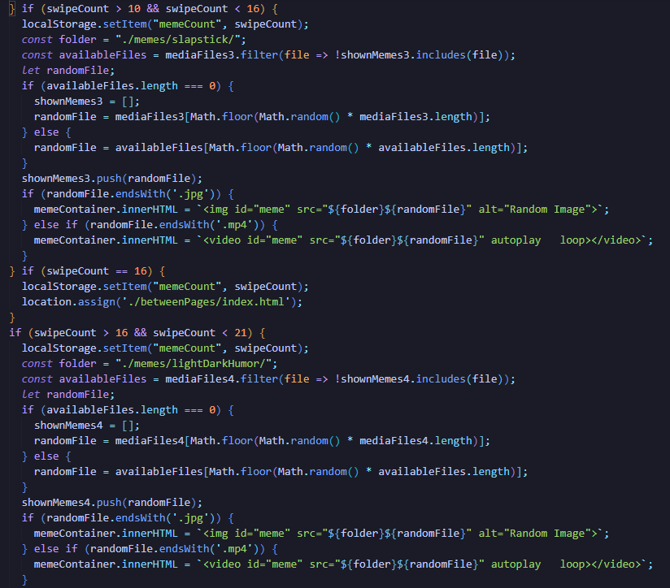
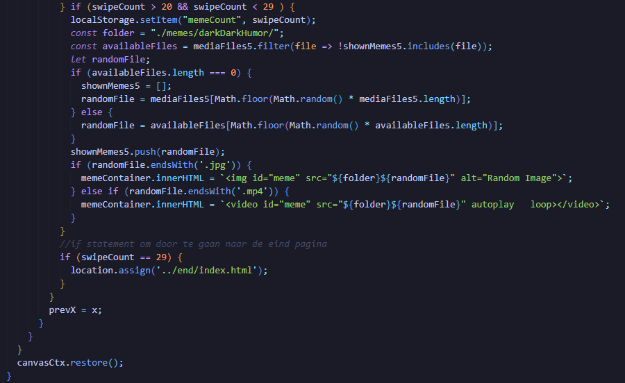

* Als er 90 seconden lang geen swipe beweging plaatsvind terug naar de start pagina gaan. (De code komt ook voor op de into en face pagina's)

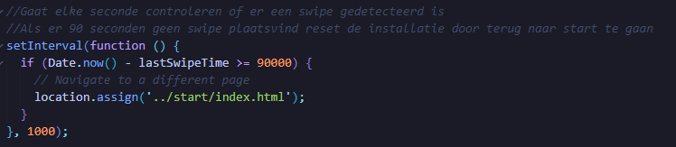

### End pagina

De end pagina is zeer simpel. De user krijgt de camera feed te zien en na 30 seconden navigeert de pagina weer naar de start pagina.

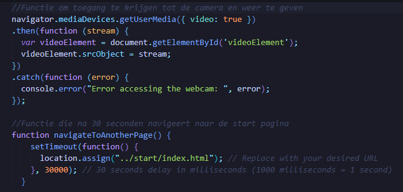

## Stap 3: Led Installatie

Eerst moeten we de LED-matrix in zijn werking zetten.

### Zet de LED-matrix in werking

Om te beginnen moet de kabel voor de voeding die bij de set is meegeleverd, worden aangesloten op de LED-matrix en de voeding.
Als er meerdere matrices met elkaar verbonden moeten worden, ga dan als volgt te werk: Er kunnen maximaal drie matrices parallel worden bediend op de 40-pins.
Hieronder zie je welke 2 kabels je erin moet steken.

Let op: Pas bij het aansluiten van meerdere matrices de voeding dienovereenkomstig aan!

### Tussenplaatsing RGB Matrix Controller

Bij onze installatie hebben wij gebruik gemaakt van een RGB Matrix Controller

Als alternatief voor het rechtstreeks verbinden van de matrices via de GPIO-strip op de Raspberry Pi, kunt u ook de RGB-Matrix controller gebruiken om maximaal drie matrices parallel aan te sturen. Ook hier is er de mogelijkheid om extra matrices in serie aan te sluiten.

Het voordeel van het aansturen via het controllerbord is de aanzienlijk eenvoudigere verbindingsmogelijkheid. Bovendien kan het controllerbord de Raspberry Pi van stroom voorzien en is er al een ventilator geïnstalleerd die voor voldoende koeling zorgt.

Je zet de RGB Matrix controller op je Raspberry PI in deze pinnen die je hieronder ziet.
  
 
 ### Installatie LED Matrix op Raspberry Pi
 
 De eerste stap om de matrix met de Raspberry Pi te kunnen bedienen is het installeren van de libary die je online kunt vinden. Open de terminal en voer het volgende in:

 ### sudo apt-get update
 ### sudo apt-get install git
 ### git clone https://github.com/hzeller/rpi-rgb-led-matrix

 Vervolgens moet het ingebouwde geluid worden uitgeschakeld van de Raspberry Pi. 
 
 Als je nog steeds geluid nodig hebt, moet je een externe USB-geluidsadapter gebruiken. 
 Om het ingebouwde geluid uit te schakelen, open je eerst het configuratiebestand via de terminal :

 ### sudo nano /boot/config.txt
 
 Zoek de regel "dtparam=audio=on" en verander deze in "dtparam=audio=off". Sla het bestand nu op met de toetscombinatie Ctrl+O, bevestig met Enter en verlaat de editor vervolgens met de toetscombinatie Ctrl+X.

 Herstart daarna de Raspberry Pi zodat de wijziging effect heeft:

 ### sudo reboot

 ## Tekst op de LED-Matrix laten gaan

 Met deze command ga je in de directory van je libary die je hebt gedownload :

 ### cd rpi-rgb-led-matrix

 Nadat je deze command hebt gedaan zit je in je directory. 
 
<<<<<<< HEAD

Om de matrix met Python te kunnen bedienen, kun je de volgende commando's uitvoeren in de terminal:

VOOR PYTHON 3:
make-build-python PYTHON=$(which python3)

Hoe je naar de map "Samples" gaat:

### cd bindings/python/samples

Daar vind je verschillende voorbeelden om je matrix te testen. Voorbeelden kunnen worden gestart met het volgende commando:

### sudo python3 ./runtext.py --led-cols=64 --text="Hello World"

Je kunt ook meerdere parameters meegeven namelijk –led-rows, –led-chain en –led-parallel.

–led-rows: Het aantal rijen in een paneel. Veelvoorkomende waarden zijn 8, 16, 32 en 64. Voor een 64×64 matrix zou de waarde 64 zijn.
–led-chain: Het aantal matrices dat in serie is verbonden. De standaardwaarde voor een enkele matrix is 1.
–led-parallel: Matrices die parallel zijn verbonden. Veelvoorkomende waarden liggen tussen 1 en 3. De standaardwaarde voor een enkele matrix is 1.

## Laat videos & fotos op de LED-Matrix zien

Nu komen we bij het creatieve gedeelte het weergeven van afbeeldingen, GIFs, graphics en volledige video's op de matrix. De beeldbestanden die moeten worden weergegeven, moeten in deze map worden opgeslagen:

### cd /home/pi/rpi-rgb-led-matrix/utils

Je kunt de LED Image Viewer gebruiken om de afbeeldingen weer te geven. Hiervoor heb je het volgende commando nodig:

### sudo ./led-image-viewer voorbeeld.gif

Video's kunnen worden afgespeeld met dit commando:

### sudo ./video-viewer voorbeeld.webm
=======

>>>>>>> f90c6ae9386c30b28cf7765643a8161047be6d10
